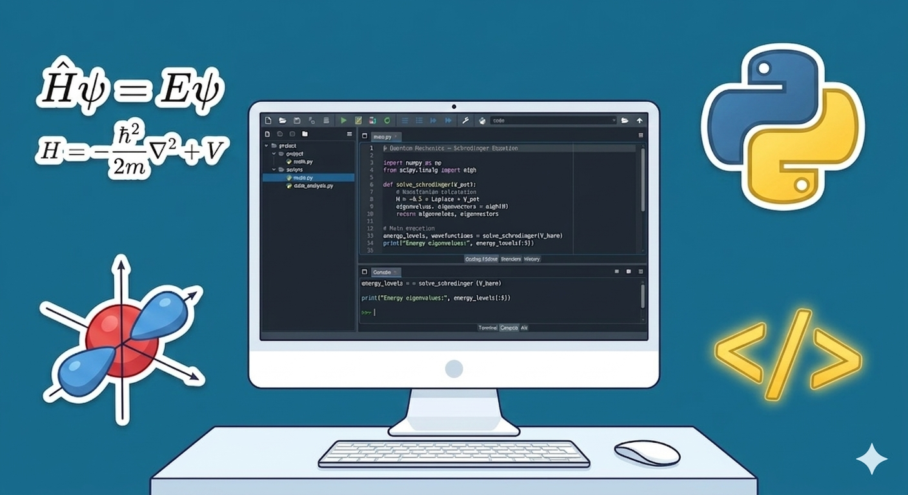

# PQM_KonstantionsTheodosiadis_16112

## Personal Info

**Name:** Konstantinos Theodosiadis

**AEM:**  16112

## Course Info

**Level:** Undergraduate

**Course:** Topics in Quantum Physics

**Semester:** 8th

## Description

Here are my projects for the undergraduate course *Topics in Quantum Physics*. The projects are scripts in Python written to solve problems in Quantum Mechanics. A reference point for these projects is Zettili's *Quantum Mechanics*.

## Assignment Description
* Assignment 1: 
